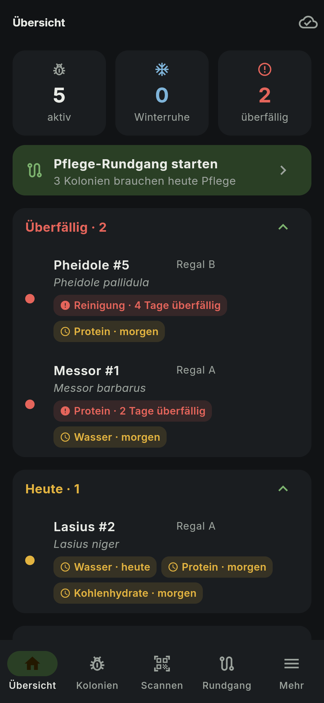
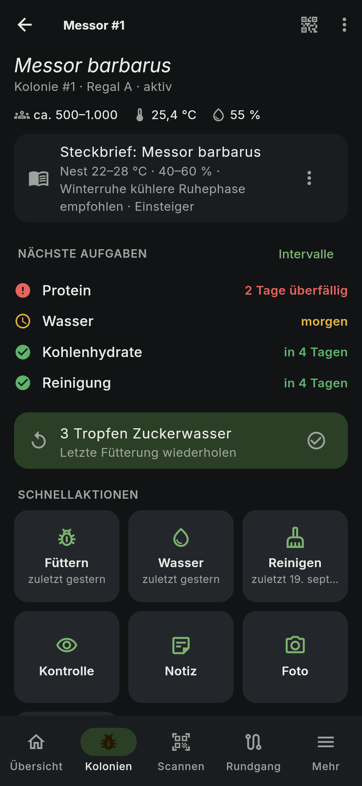
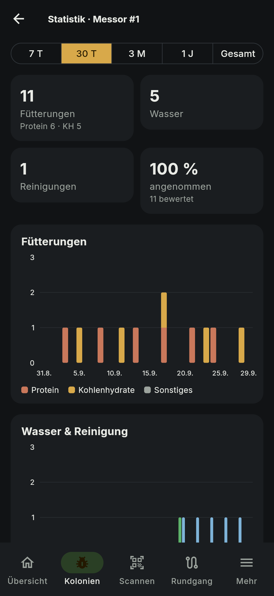
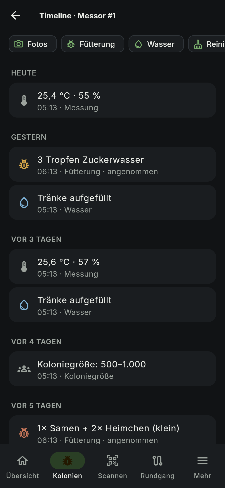
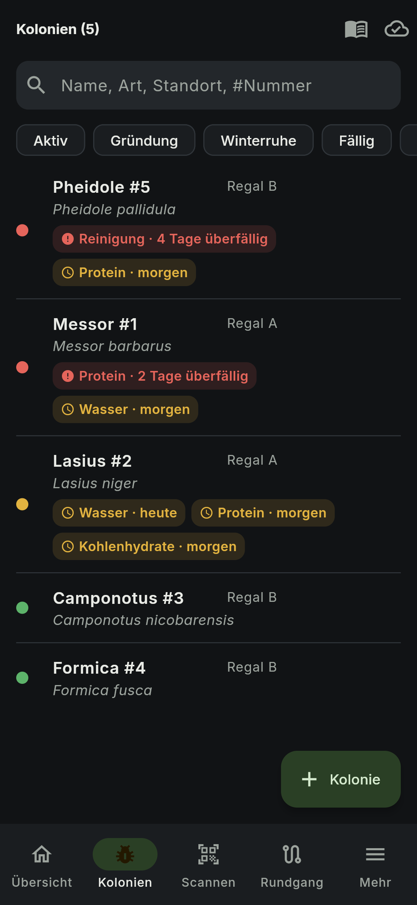
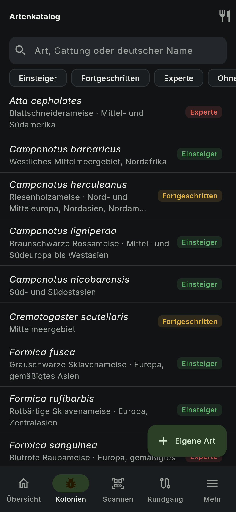
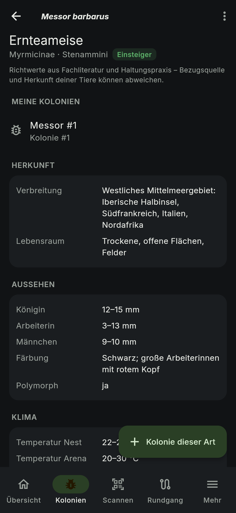
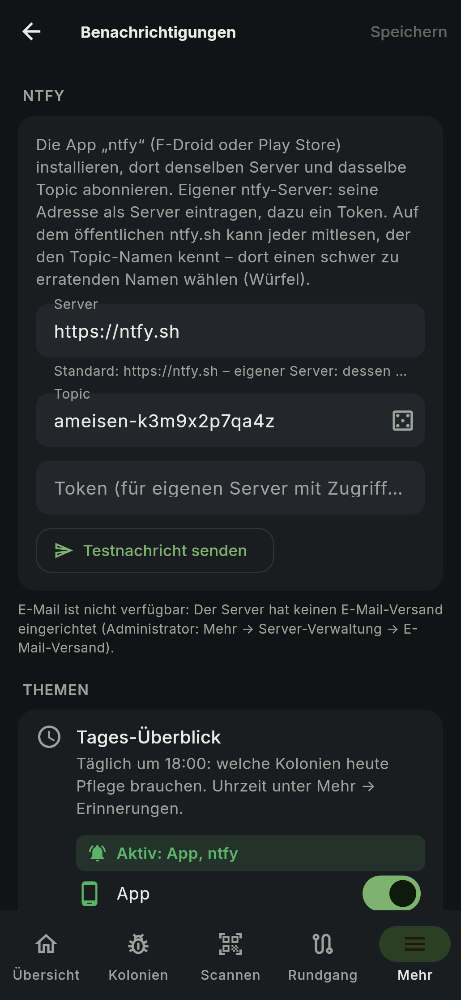
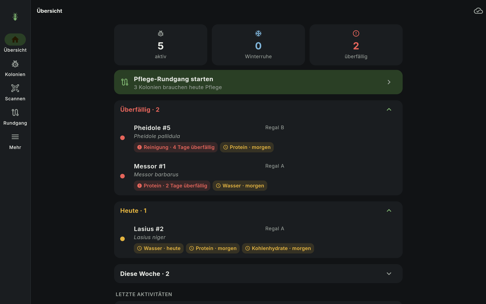

# 🐜 Ant Colony Manager

Selbst gehostete Verwaltung von Ameisenkolonien – gebaut für den echten Pflegealltag:

**Homepage:** https://daschmidt1994.github.io/ant-colony-manager/

> **SCAN → INFORMATION → AKTION → FERTIG**
> Handy an den NFC-Tag halten oder QR-Code scannen → die Kolonie ist offen, du siehst was ansteht, und dokumentierst Fütterung, Wasser oder Reinigung mit einem Tap.

- **Android-App** (offline-fähig) und **Web-App** mit denselben Daten
- **NFC-Tags und QR-Etiketten** pro Kolonie, Pflege-Rundgang für viele Kolonien
- **Fälligkeiten mit Ampel**, Winterruhe, Timeline, Fotos, Messwerte, Sensor-Schnittstelle
- **Widget für den Startbildschirm** (Android) – überfällig/heute fällig auf einen Blick, Tippen öffnet den Rundgang
- **Kalender-Abo und Home Assistant** – Fälligkeiten in jedem Kalender, Status pro Kolonie für Automationen ([docs/22](docs/22-kalender-home-assistant.md))
- **Benachrichtigungen per App, ntfy oder E-Mail** – Tages-Überblick, überfällige Pflege, Sensor-Alarm, Winterruhe; Häufigkeit, Ruhezeiten, „Morgen“ zum Verschieben
- **Futtervorrat** – Futtertiere, Zuckerwasser und Zuchten mit Haltbarkeit, Nachbestell- und Versorgungs-Hinweisen
- **Artenkatalog** mit Steckbrief (Klima, Winterruhe, Futter, Haltung, Quellen) – mit den eigenen Kolonien verknüpft
- **Deutsch und Englisch** (weitere Sprachen: eine Übersetzungsdatei, [docs/21-sprachen.md](docs/21-sprachen.md)); Fotos auch aus der Galerie, mit Aufnahmedatum
- **Vollständig selbst gehostet** – eine `docker compose`-Installation, kein Cloud-Zwang, keine Telemetrie (nur eine abschaltbare Update-Prüfung gegen die öffentliche GitHub-Release-Liste, `UPDATE_CHECK=false`)
- **Deine Daten gehören dir** – JSON-Export, Backups als normale Dateien

## Screenshots

| Übersicht | Kolonie | Statistik | Timeline |
|:---:|:---:|:---:|:---:|
|  |  |  |  |
| **Kolonien** | **Artenkatalog** | **Steckbrief** | **Benachrichtigungen** |
|  |  |  |  |



*Web-App im dunklen Design mit Beispieldaten; die Android-App sieht gleich aus.*

## Projektstand

| Phase | Inhalt | Stand |
|---|---|---|
| 1 | Planung: Architektur, Datenmodell, Sync-, NFC-, Sicherheits- und Backup-Konzept | ✅ [docs/](docs/README.md) |
| 2 | UX/UI: Designsystem, Screens, User Flows | ✅ [docs/11–13](docs/12-screens.md) |
| 3 | Datenbank & Backend (Go, PostgreSQL 18), API, Tests | ✅ [server/](server/README.md) |
| 4 | Docker, Backup/Restore, Reverse Proxy, Updates | ✅ diese Datei |
| 5 | Android-MVP (Flutter) + Web-App: Login, Dashboard, Kolonien, Fütterung/Wasser/Reinigung, Timeline, lokale DB + Sync | ✅ [app/](app/README.md) |
| 6 | QR-Scanner, NFC zuweisen/scannen, Deep Links, App Links, Etiketten-PDF, Signatur | ✅ |
| 7 | Offline-Sync vollständig: Hintergrund-Sync, Netz-/Server-Signale, Tab-Schutz, Geräte-Abmeldung, Chaos-Tests | ✅ |
| 8 | Pflege-Rundgang: Scan-Workflow für viele Kolonien, offline, mit Zusammenfassung | ✅ [docs/](docs/README.md#phase-8--pflege-rundgang-umgesetzt) |
| 9 | Fotos, Erinnerungen (Android + E-Mail), Statistiken & Diagramme, Sensoren mit Grenzwert-Alarm, PDF-Koloniebericht, Export (JSON/CSV/Fotos) | ✅ [docs/](docs/README.md#phase-9--fotos-erinnerungen-statistiken-sensoren-berichte-export-umgesetzt) |

Die Web-App ist im Server-Image enthalten. Die Android-App gibt es als APK in den [Releases](https://github.com/daschmidt1994/ant-colony-manager/releases) und über [F-Droid](docs/18-fdroid.md).

## Architektur

```text
 Android-App ──┐                        ┌─ Docker Compose ──────────────────────────────┐
 (offline,     │   HTTPS  /api/v1       │  proxy  Caddy (optional, HTTPS)                │
  NFC/QR)      ├──────────────────────► │  app    Go-Server: API + Web-App + Realtime    │
 Web-App ──────┘   /c/<code>  (QR/NFC)  │  db     PostgreSQL 18                          │
                                        │  backup nächtliche Backups + Restore-Werkzeug  │
                                        │  init   legt Verzeichnisse und Secrets an      │
                                        └──────────────── ./data ───────────────────────┘
```

Details: [Systemarchitektur](docs/02-systemarchitektur.md) · [Datenmodell](docs/03-datenmodell.md) · [Sync](docs/05-sync.md) · [NFC/QR](docs/06-nfc-qr-deeplinks.md) · [Sicherheit](docs/08-auth-sicherheit.md)

## Voraussetzungen

- Linux-Rechner, VPS, Mini-PC, Raspberry Pi 4/5 (64-bit) oder NAS mit Docker (Synology Container Manager, QNAP Container Station)
- **Docker** mit **Compose v2.24+** (`docker compose version`)
- `amd64` oder `arm64`, ca. **300 MB RAM** im Leerlauf, Speicher für Fotos und Backups
- Für Internet-Zugriff: eine Domain, Ports 80/443 · Für den reinen Heimnetz-Betrieb: nichts weiter

## Installation (Quick Start)

```bash
git clone https://github.com/daschmidt1994/ant-colony-manager.git
cd ant-colony-manager

./scripts/init-env.sh          # erzeugt .env mit der IP dieses Rechners
# oder: cp .env.example .env && nano .env   (PUBLIC_APP_URL anpassen)

docker compose up -d
docker compose ps              # nach ~1 Minute: alle Dienste "healthy"
```

Compose lädt die fertigen Images von GHCR. Sind sie nicht erreichbar, baut Compose sie beim ersten Start selbst (einige Minuten; Meldungen `denied` beim Pull sind dann normal). Der Web-App-Build braucht dabei deutlich mehr als 1 GB RAM (mit 900 MB scheitert er) – auf kleineren Rechnern (Raspberry Pi, NAS) besser fertige Images verwenden oder `ACM_WEB_BUILD=placeholder` setzen (Server ohne Weboberfläche).

Danach:

1. **Setup-Code** aus dem Log holen: `docker compose logs app | grep -A1 Setup-Code`
2. `http://<server>:8080/setup` öffnen → Code eingeben → **Admin-Konto** anlegen
3. Erste Kolonie anlegen – sie bekommt automatisch einen QR-Code
4. Android-App installieren – am besten über F-Droid, dann kommen Updates automatisch ([docs/18-fdroid.md](docs/18-fdroid.md)) – Server-Adresse eingeben, anmelden

**Unraid, Synology, Portainer/Dockhand:** fertige Compose-Datei zum Einfügen – [`deploy/docker-compose.yml`](deploy/docker-compose.yml), Anleitung [docs/17-unraid-dockhand.md](docs/17-unraid-dockhand.md).

### Im Internet mit HTTPS

```bash
./scripts/init-env.sh https://ants.example.com   # nutzt .env.production.example, aktiviert Caddy
docker compose up -d
```

DNS-Eintrag auf den Server zeigen lassen und Ports 80/443 freigeben; Caddy holt das Zertifikat automatisch. Für Domains im Heimnetz (`ants.home.arpa`) verwendet Caddy eine eigene CA (`ACM_TLS_MODE=internal`) – deren Root-Zertifikat liegt unter `data/caddy/data/caddy/pki/authorities/local/root.crt` und wird einmal auf den Geräten installiert.

**Eigener Reverse Proxy** statt Caddy: [Nginx](deploy/examples/nginx.conf) · [Traefik](deploy/examples/compose.traefik.yml) · [Nginx Proxy Manager](deploy/examples/nginx-proxy-manager.md). Wichtig: `/api/v1/sync/events` nicht puffern, Uploads bis 64 MB erlauben, `TRUSTED_PROXIES` setzen.

## Konfiguration

Alles steht kommentiert in [`.env.example`](.env.example) (Heimnetz) bzw. [`.env.production.example`](.env.production.example) (Internet). Die wichtigsten Werte:

| Variable | Bedeutung |
|---|---|
| `PUBLIC_APP_URL` | Adresse für Browser, App und **QR/NFC-Links** (`<URL>/c/<code>`). Nie im Code fest verdrahtet. |
| `DATA_DIR` | Ort aller Daten (Standard `./data`) |
| `PUID` / `PGID` | Besitzer der Dateien (Synology meist `1026`/`100`) |
| `REGISTRATION_MODE` | `invite` (Standard) · `open` · `closed` |
| `SMTP_*` | optional – einfacher in der App: Mehr → Server-Verwaltung → E-Mail-Versand (hat Vorrang) |
| `BACKUP_*` | Zeitplan und Aufbewahrung |
| `COMPOSE_PROFILES=proxy`, `ACM_DOMAIN` | eingebauter HTTPS-Proxy |

**Secrets** (Datenbank-Passwort, `JWT_SECRET`, `INSTANCE_SECRET`) erzeugt der Stack beim ersten Start selbst und legt sie in `data/secrets/` ab. Werte in der `.env` haben Vorrang. Der Server startet nicht mit fehlenden, zu kurzen oder Beispiel-Secrets.

### Wo liegen meine Daten?

```text
data/
├── postgres/   Datenbank
├── uploads/    Fotos
├── backups/    Backups (ein Ordner pro Backup)
├── secrets/    automatisch erzeugte Secrets – mit sichern!
└── caddy/      Zertifikate (nur mit Proxy)
```

Container neu erstellen, updaten oder löschen berührt diese Daten nie. **Nur das Löschen von `data/` löscht Daten.**

## Backup

- Automatisch jede Nacht um 03:00 (`BACKUP_SCHEDULE`), Aufbewahrung 7 täglich / 4 wöchentlich / 6 monatlich.
- Datenbank (`pg_dump`) + Fotos (inkrementell über Hardlinks – unveränderte Fotos kosten keinen Platz) + Prüfsummen + Manifest.
- `docker compose ps` zeigt den Backup-Dienst als *unhealthy*, wenn seit 26 h kein Backup gelang.

```bash
./scripts/backup.sh                    # jetzt sichern
./scripts/backup.sh --tag vor-umzug    # benanntes Backup (wird nie automatisch gelöscht)
./scripts/backup.sh list               # Übersicht
./scripts/verify-backup.sh             # Prüfsummen + Test-Restore in eine temporäre DB
```

> **Offsite:** Ein Backup auf derselben Platte schützt nicht vor Plattendefekt oder Diebstahl. Kopiere `data/backups/` regelmäßig woanders hin – Beispiel mit restic: [offsite-restic.sh](deploy/examples/offsite-restic.sh), auf NAS z. B. Hyper Backup.
> Sichere zusätzlich `data/secrets/` und `.env` (enthält keine Daten, aber das Instanz-Secret, das für per Seriennummer registrierte NFC-Tags gebraucht wird).

## Restore

```bash
./scripts/backup.sh list
./scripts/restore.sh 2026-09-26T0300
```

Das Skript prüft die Prüfsummen, legt ein Sicherheits-Backup des aktuellen Stands an (`…-pre-restore`), stoppt die App, stellt Datenbank und Fotos wieder her, vergleicht die Datensatzzahlen mit dem Manifest und startet die App wieder (ältere Backups werden dabei automatisch migriert). Verbundene Apps laden danach den wiederhergestellten Stand; noch nicht gesendete Offline-Einträge gehen nicht verloren.

**Umzug auf neue Hardware:** Repository klonen, `.env` und `data/secrets/` übernehmen, Backup-Ordner nach `data/backups/` kopieren, `docker compose up -d`, dann `./scripts/restore.sh <name>`.

Der vollständige Ablauf Installation → Backup → Zerstören → Restore → Neustart wird automatisch getestet: `./scripts/test-stack.sh`.

## Update

```bash
./scripts/update.sh
```

= Backup `…-pre-update` → `git pull` → neue Images holen/bauen → Neustart → warten bis *healthy*. Datenbank-Migrationen laufen beim Start automatisch (eine Transaktion pro Migration). Eine ältere App-Version startet nicht gegen ein neueres Schema (Schutz vor Downgrade). Feste Version: `ACM_VERSION=1.1.0` in `.env`.

## Android-App

Schritt für Schritt mit Test auf dem Handy: [docs/16-anleitung-installieren-testen.md](docs/16-anleitung-installieren-testen.md).

**Download:** [neueste APK (arm64, fast alle Handys)](https://github.com/daschmidt1994/ant-colony-manager/releases/latest/download/app-arm64-v8a-release.apk) · [alle Versionen](https://github.com/daschmidt1994/ant-colony-manager/releases). Die APK wird von der CI gebaut und signiert, automatische Updates über [F-Droid](docs/18-fdroid.md). Installieren, dann entweder die Server-Adresse eingeben oder in der Web-App „Mehr → Android-App verbinden“ öffnen und den QR-Code mit der App scannen. Die App funktioniert offline und synchronisiert automatisch.

**NFC & QR:** Kolonie öffnen → ⋮ → „NFC-Tag zuweisen“ → Tag ans Handy halten. Danach genügt Antippen, auch wenn die App geschlossen ist. QR-Etiketten: „Mehr → Etiketten drucken“ (Einzeletiketten, Brother 62 mm, A4-Bögen). Verifizierte App Links für die Kamera-App: siehe [app/README.md](app/README.md#signatur-und-app-links). NFC-Tags und der In-App-Scanner funktionieren mit jeder Domain und auch im Heimnetz per `http://`; für das direkte Öffnen per Kamera-App kann eine APK mit eigener Domain gebaut werden ([Details](docs/06-nfc-qr-deeplinks.md#5-deep-links--app-links--die-ehrliche-einschränkung)).

## Troubleshooting

| Problem | Lösung |
|---|---|
| `app` bleibt *unhealthy* | `docker compose logs app` – bei „configuration invalid“ steht die fehlende/falsche Variable direkt dabei |
| Setup-Code weg | `docker compose logs app \| grep -A1 Setup-Code` (erscheint bei jedem Start, solange kein Konto existiert) |
| `storage not writable` / Rechte-Fehler | `PUID`/`PGID` in `.env` an den Besitzer von `data/` anpassen, `docker compose up -d` (der `init`-Dienst korrigiert die Rechte) |
| Passwort vergessen, kein SMTP | `docker compose exec app /acm user reset-link du@example.com` |
| Admin-Rechte verloren | `docker compose exec app /acm user make-admin du@example.com` |
| QR-Codes zeigen falsche Adresse | `PUBLIC_APP_URL` korrigieren, `docker compose up -d`; alte Adresse in `LEGACY_APP_URLS` eintragen, damit vorhandene NFC-Tags weiter erkannt werden |
| Netzwerk-Konflikt beim Start | `ACM_SUBNET` in `.env` auf ein freies Netz ändern |
| Port 8080 belegt | `APP_PORT` ändern (und `PUBLIC_APP_URL`) |
| Backup-Dienst *unhealthy* | `docker compose logs backup`, `cat data/backups/status.json` |
| Handy erreicht den Server nicht | gleiches WLAN? Firewall auf dem Server (Port `APP_PORT`)? |

Status auf einen Blick: `docker compose ps` · Logs: `docker compose logs -f` (enthalten keine Passwörter, Tokens oder Scan-Codes) · Diagnose: `http://<server>:8080/readyz`

## Entwicklung

```bash
cp .env.example .env
docker compose -f compose.yml -f compose.dev.yml up   # Hot Reload, Mailpit (http://localhost:8025)

./scripts/test-server.sh      # Backend-Tests gegen Wegwerf-PostgreSQL 18
./scripts/test-stack.sh       # End-to-End: Docker-Stack, Backup, Restore, Proxy
```

Go ist lokal nicht nötig (`./scripts/go.sh go …` nutzt einen Container). Mehr in [server/README.md](server/README.md). Die CI (GitHub Actions) führt Backend-Tests mit Race-Detector, ShellCheck und den End-to-End-Test aus und baut Multi-Arch-Images (`linux/amd64`, `linux/arm64`) nach GHCR.

## Versionen und Releases

Server, Web-App und Android-App haben **eine gemeinsame Version** nach [SemVer](https://semver.org/lang/de/); sie steht in [`app/pubspec.yaml`](app/pubspec.yaml). Nur dort ändern (macht `scripts/release.sh`) – die CI gibt sie an Server, Web-App und APK weiter. Teststände aus `dev` heißen überall gleich `1.2.0-dev.<commit>` (ACM Test und `edge`-Server). In der App unter **Mehr → Server** stehen beide Versionen; passen sie nicht zusammen, erscheint ein Hinweis.

| Änderung | Beispiel |
|---|---|
| Fehlerbehebung | `1.1.0` → `1.1.1` |
| neue Funktion, kompatibel | `1.1.1` → `1.2.0` |
| alte App und neuer Server (oder umgekehrt) passen nicht mehr zusammen | `1.2.0` → `2.0.0` |

```bash
./scripts/release.sh 1.2.0     # Version setzen → Commit → Tag v1.2.0 → pushen (fragt vorher nach)
./scripts/release.sh 2.0.0 --breaking "Was sich ändert und was vorher zu tun ist"
```

Der Tag `v1.2.0` baut in der CI die Server-Images (`1.2.0`, `1.2`, `latest`), das GitHub-Release **v1.2.0** mit den APKs und der Compose-Datei und aktualisiert das F-Droid-Repo. Branches: **`main`** ist der fertige Stand für den Betrieb, **`dev`** der Teststand. Pushes auf `dev` bauen Images als `edge` und die Test-App **ACM Test** (eigene App-ID, läuft neben der echten App) im selben F-Droid-Repo – zum Ausprobieren auf einer [Testinstanz](docs/19-testinstanz.md). Getestet → `dev` nach `main` mergen → Release per Tag. Die Buildnummer der APK (Android `versionCode`) ist die fortlaufende CI-Laufnummer.

**Breaking Changes:** Mit `--breaking` landet der Text in den Release-Notizen unter „⚠ Breaking Changes“ (Pflicht für eine neue Hauptversion). Der Server prüft alle 6 Stunden die Release-Liste auf GitHub; steht ein Update mit Breaking Change an, zeigt die App auf der Übersicht eine rote Warnung mit dem Text und der Reihenfolge *Backup → Server → App*. Normale Updates stehen nur unter Mehr → Server.

## Lizenz

[GNU Affero General Public License v3.0](LICENSE) (AGPL-3.0-only). Du darfst den Code nutzen, ändern und weitergeben; wer eine geänderte Version weitergibt oder als Dienst im Netz anbietet, muss den Quellcode unter derselben Lizenz offenlegen. Ohne Gewähr.

Ein Hobbyprojekt, entwickelt mit [Claude Code](https://claude.com/claude-code).
