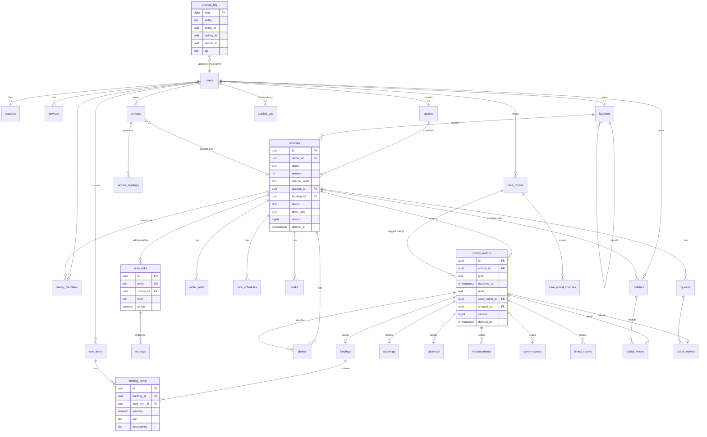

# 03 – Datenmodell (PostgreSQL)

Vollständiges DDL: [schema-draft.sql](schema-draft.sql) (gegen PostgreSQL 18 ausgeführt und geprüft).

## 1. Konventionen

| Regel | Umsetzung |
|---|---|
| Primärschlüssel | `uuid`, **UUIDv7** (zeitlich sortierbar → gute Index-Lokalität). Wird für synchronisierte Tabellen **vom Client erzeugt**; Server-Default `uuidv7()` |
| Öffentliche URLs | nie Primärschlüssel, sondern **zufällige Scan-Tokens** (`scan_links.token`, 16 Zeichen Base62 ≈ 95 Bit) |
| Zeitstempel | `timestamptz`. `occurred_at` = fachlicher Zeitpunkt (vom Nutzer), `created_at/updated_at` = technisch (Server) |
| Sync-Spalten | jede synchronisierte Tabelle: `version bigint` (= `server_seq` der letzten Änderung), `deleted_at` (Tombstone), `created_by`, `updated_by` |
| Enums | `text` + `CHECK` statt PG-`ENUM` → Migrationen ohne Table-Rewrite, einfacher für Sync |
| Mandantentrennung | Kolonie-Daten hängen an `colony_id` → Zugriff über `colony_members`; nutzerbezogene Stammdaten (Standorte, Futtermittel, Nester) über `owner_id` |
| Löschen | fachlich **Soft-Delete** (Tombstone), physisches Löschen erst durch GC nach Aufbewahrungsfrist bzw. beim Löschen des Accounts |
| Freitext-Suche | `pg_trgm`-GIN-Indizes auf Name/Art/Gattung; clientseitig SQLite FTS5 |

## 2. Kernidee: Event-Basistabelle + typisierte Detailtabellen

Alle dokumentierbaren Vorgänge sind **Events** einer Kolonie. Die Tabelle `colony_events` enthält die gemeinsamen Felder (Typ, Zeitpunkt, Notiz, Autor, Rundgang), typisierte 1:1-Detailtabellen enthalten die spezifischen Werte:

```text
colony_events (id, colony_id, type, occurred_at, note, care_round_id …)
   ├─ 1:1 feedings          (acceptance) ─── 1:n feeding_items (food_item, Menge, Einheit)
   ├─ 1:1 waterings         (kinds[])
   ├─ 1:1 cleanings         (kinds[])
   ├─ 1:n measurements      (metric, value, unit)
   ├─ 1:1 colony_counts     (exakt | Schätzbereich)
   ├─ 1:n brood_counts      (stage, exakt | Level)
   ├─ 1:1 habitat_moves     (from_habitat, to_habitat, reason)
   ├─ 1:1 queen_events      (queen_id, action)
   └─ Notiz / Kontrolle / Problem / Foto / Winterruhe: nur Basistabelle (+ Referenzen)
```

**Warum so?**
- **Timeline** = eine indizierte Abfrage auf `colony_events (colony_id, occurred_at DESC)` – kein `UNION` über 10 Tabellen.
- **Statistiken** bleiben typisiert und performant (z. B. Summe Proteinfütterungen).
- **Sync**: Ein Event + Details = *ein* Aggregat, *eine* Operation, *eine* Idempotenz-ID.
- Die geforderten Entitäten `Feeding`, `Cleaning`, `Watering`, `Measurement`, `ColonyCount`, `BroodCount`, `HabitatHistory`, `Event` bilden sich 1:1 darauf ab.

## 3. Entitäten (Überblick)

| Gruppe | Tabellen |
|---|---|
| Benutzer & Auth | `users`, `sessions` (Refresh-Tokens), `devices`, `password_resets`, `invitations`, `user_settings` |
| Zugriff | `colony_members` (owner / editor / viewer) |
| Stammdaten | `species`, `food_items`, `locations` (hierarchisch), `habitats` |
| Kolonie | `colonies`, `queens`, `winter_rests` |
| Events | `colony_events`, `feedings`, `feeding_items`, `waterings`, `cleanings`, `measurements`, `colony_counts`, `brood_counts`, `habitat_moves`, `queen_events` |
| Planung | `care_schedules` (Intervalle), `tasks` (Einzelaufgaben), `reminder_settings` |
| Pflege-Rundgang | `care_rounds`, `care_round_colonies` |
| Medien | `photos` |
| Scan | `scan_links` (QR + NFC-URL-Token), `nfc_tags` (physische Tags) |
| Sensoren | `sensors`, `sensor_readings` |
| Sync | `sync_counter`, `change_log`, `applied_ops`, `sync_conflicts` |
| Betrieb | `audit_log`, `jobs` |

Ein paar Details:

- **`colonies`**: `name`, `internal_code` (z. B. `MB-12`, pro Nutzer eindeutig), `number` (für „Kolonie #12“), `species_id` (+ `species_text` als Freitext-Fallback), `origin` (wild / gekauft / Zucht / Tausch), `find_location`, `found_on`, `bought_on`, `seller`, `founded_on`, `location_id`, `status`, `gyne_type` (monogyn / polygyn / unbekannt), `archived_at`. Denormalisierte Anzeigefelder (`current_worker_estimate_min/max`, `queen_count`) werden serverseitig per Trigger/Service gepflegt, **nicht** vom Client geschrieben.
- **`species`**: kleiner mitgelieferter Katalog (`owner_id IS NULL`) + eigene Arten (`owner_id = user`). Gattung als Spalte → „Kolonien nach Gattung“ ohne Parsing.
- **`food_items`**: Systemkatalog (Schabe, Heimchen, Zuckerwasser …) + eigene. `category`: protein / carbohydrate / other. Eine Fütterung mit mehreren Positionen (2 × Schabe + Zuckerwasser) = mehrere `feeding_items`.
- **`care_schedules`**: `task_type` (protein, carbohydrate, feeding, water, cleaning, check, custom), `interval_days`, `winter_mode` (pause / scale / keep), `winter_factor`. Welche Events eine Aufgabe „erfüllen“ ist fest definiert (z. B. `protein` ← Fütterung mit mind. einem Protein-Item).
- **`locations`**: Adjazenzliste (`parent_id`) + serverseitig gepflegter `path` (materialisiert, z. B. `Ameisenraum/Regal A/Ebene 3`) für schnelles Filtern „alles unter Regal A“.
- **`habitats`**: Nester/Arenen des Nutzers; `colony_id` = aktuell zugeordnete Kolonie (NULL = im Lager). Umzüge als `habitat_moves`-Events → vollständige Historie.
- **`photos`**: Zuordnung zu Kolonie + optional Event / Königin / Nest. `sha256`, Größe, Maße, `taken_at` (EXIF). `upload_state` (pending / stored) für den Offline-Upload.
- **`scan_links`**: `token`, `colony_id`, `kind` (qr / nfc), `active`, `revoked_at`. Neu generieren = alten deaktivieren + neuen anlegen.
- **`nfc_tags`**: `uid_hash` (Hardware-UID, gehasht), `scan_link_id`, `tag_type` (NTAG213 …), `locked`, `label`.
- **`sensor_readings`**: hochvolumig, **nicht** Teil der Timeline und **nicht** voll synchronisiert (App bekommt nur letzte Werte/Aggregate). BRIN-Index auf Zeit.

## 4. ER-Diagramm



## 5. Wichtige Indizes

| Index | Zweck |
|---|---|
| `colony_events (colony_id, occurred_at DESC) WHERE deleted_at IS NULL` | Timeline |
| `colony_events (colony_id, type, occurred_at DESC)` | „letzte Fütterung/Wasser“ → Fälligkeit, „Wiederholen“ |
| `colony_members (user_id, colony_id)` | Berechtigungs-Join |
| `colonies USING gin (name gin_trgm_ops)`, `species (scientific_name gin_trgm_ops)` | Suche |
| `colonies (owner_id, status)`, `(location_id)` | Filter |
| `scan_links (token)` UNIQUE | Scan-Auflösung |
| `nfc_tags (uid_hash)` | Tag-Erkennung ohne URL |
| `change_log (seq)` PK + `(colony_id, seq)`, `(owner_id, seq)` | Pull-Cursor |
| `sensor_readings USING brin (measured_at)` | Zeitreihen |

## 6. Lokales Schema (Drift)

Das Drift-Schema spiegelt die synchronisierten Tabellen 1:1 (gleiche UUIDs, gleiche Spaltennamen), ergänzt um:

| Spalte/Tabelle | Zweck |
|---|---|
| `sync_state` pro Zeile | `synced` / `pending` / `conflict` |
| `server_version` | letzte bekannte Server-Version (Basis für Konflikterkennung) |
| `outbox` | ausstehende Operationen (siehe 05) |
| `photo_uploads` | Upload-Queue mit lokalem Dateipfad |
| `sync_meta` | Pull-Cursor, letzter erfolgreicher Sync, Server-ID |
| `colonies_fts` (FTS5) | schnelle lokale Suche |

Nicht lokal gespeichert: `sessions`, `applied_ops`, `change_log`, `audit_log`, `sensor_readings` (nur Aggregate), Daten anderer Nutzer.
